# MQTT-Auto-Dicovery-Home-Assistant-ESP32
**Installation and Configuration Guide: Home Assistant & ESP32 (MQTT)**

This guide describes the steps required to deploy Home Assistant on a
virtual machine and configure communication with an ESP32
microcontroller using the MQTT protocol.

**1. Installing Home Assistant on Oracle VirtualBox**

The installation is based on using a preconfigured virtual disk image
for Windows.

1.  **Downloading the image:** Download the official Home Assistant
    image (.vdi format) for Windows from the website.

<https://www.home-assistant.io/installation/windows/>

2.  **Creating the Virtual Machine (VM):**

- Launch Oracle VirtualBox and create a new machine.

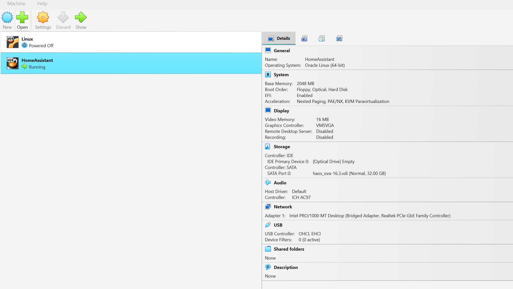

- **System type :** Select "**Linux**".

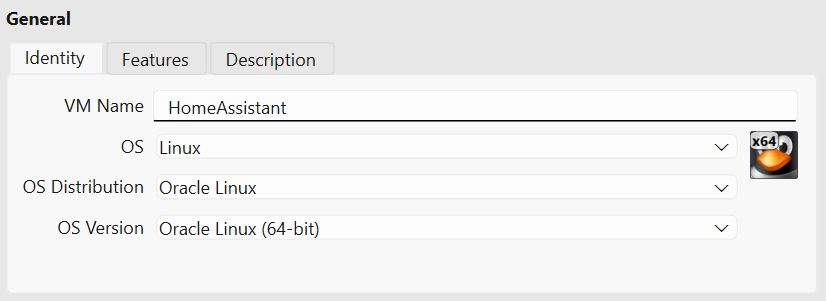

- **Firmware configuration:** In the system settings, make sure to check
  the "**Use EFI**" option.

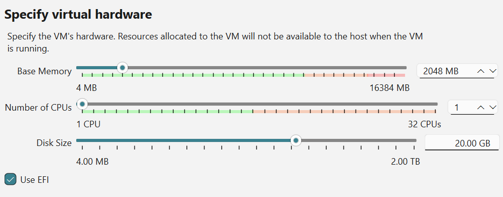

- **Hard Drive:** Select the "**Use an existing virtual hard disk
  file**" option and import the previously downloaded **.vdi** file.

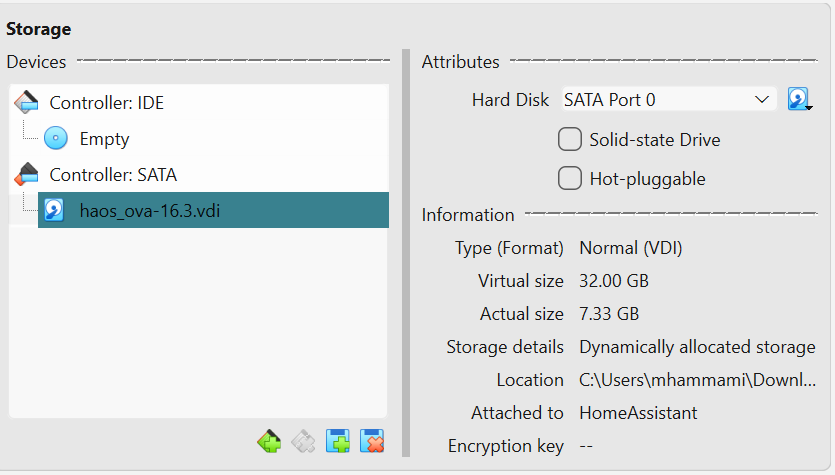

3.  **Network Configuration:** Enable network access in "**Bridged**"
    mode to allow the VM to communicate with your local network.

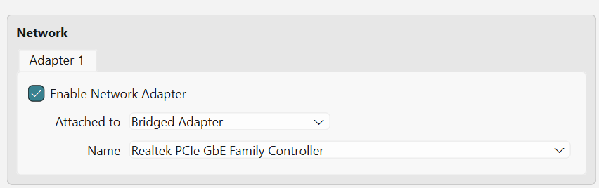

4.  **Initialization:** Start the virtual machine. The system will
    automatically proceed with its initial configuration.

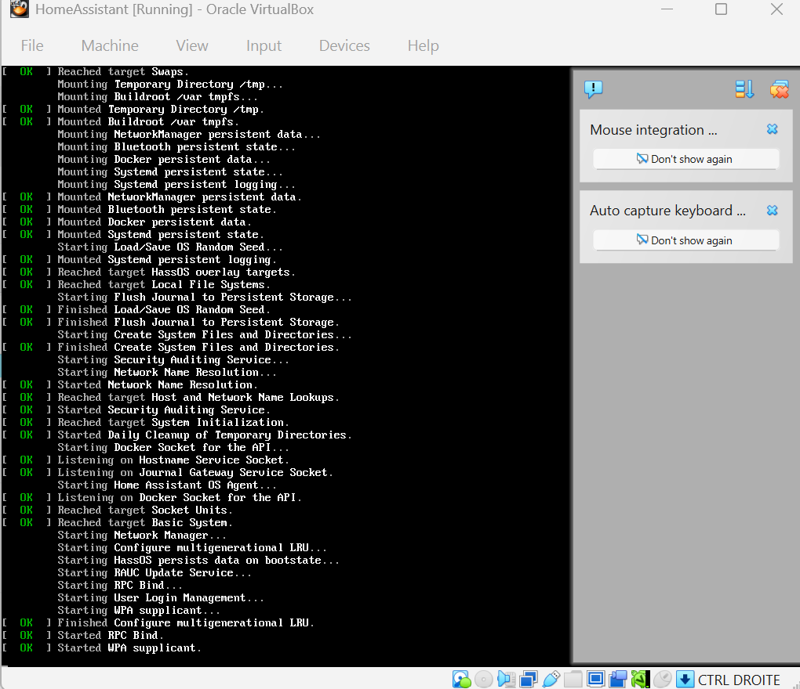

**2. Initial Home Assistant Configuration**

Once the system has started, the interface is accessible via your web
browser.

1.  **Accessing the interface:** Enter the IP address displayed on the
    virtual machine console into your browser.

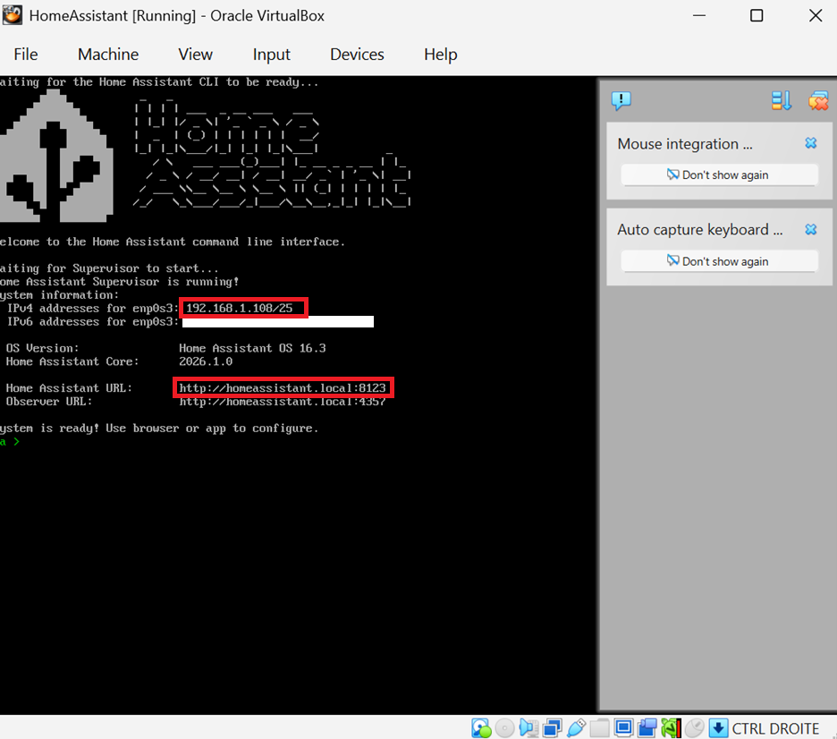

2.  **Account setup:** Follow the instructions to create your account.

3.  **Login:** Authenticate with your username and password to access
    the dashboard.

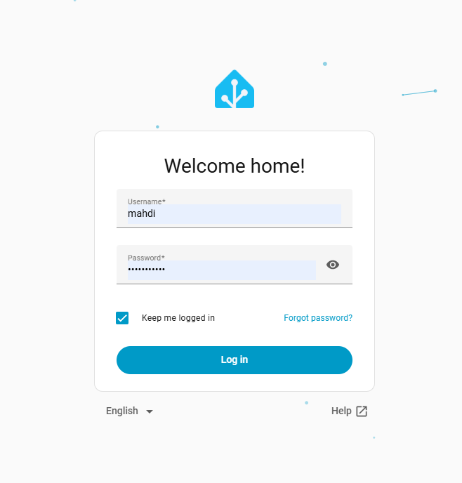

**3. Setting up the MQTT Broker (Mosquitto)**

To allow your ESP32 to communicate with Home Assistant, you must install
an MQTT broker.

1.  **Advanced Mode:** Enable "**Advanced mode**" in your user profile
    settings.

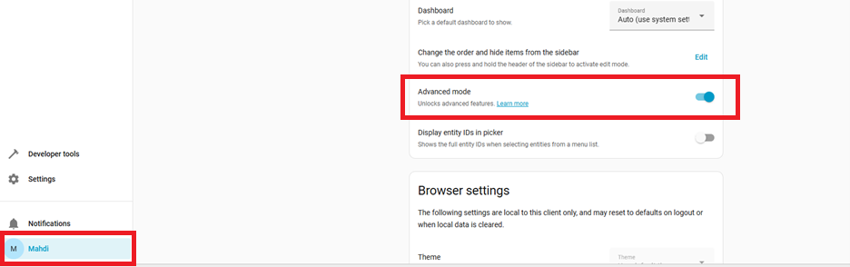

2.  **Add-on Installation :**

- Go to **Settings \> Add-ons**.

- Search and install **Mosquitto broker**.

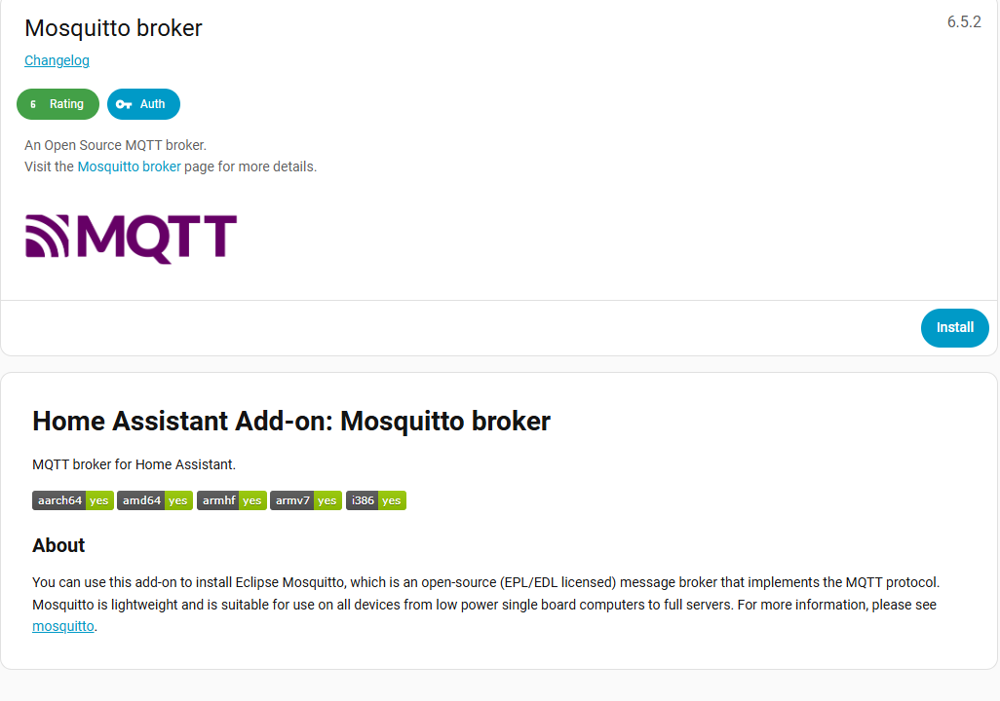

3.  **Add-on Configuration:** Enable the "Start on boot," "Watchdog,"
    and "Auto update" options, then click "**Start**."

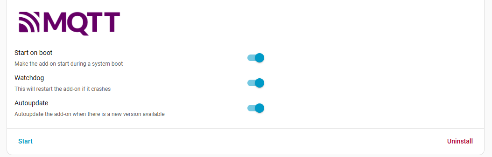

4.  **Security:** Create a specific user for MQTT in Home Assistant
    (username and password) to secure the connection of your devices.

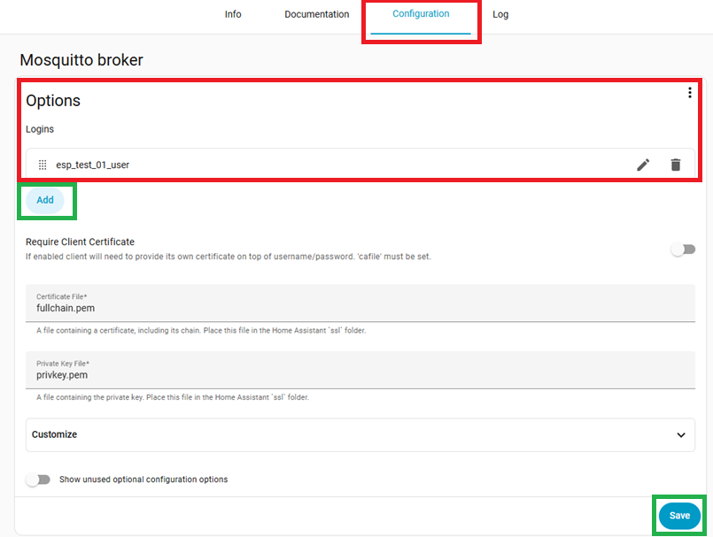

5.  **Finalization:** Save the configuration and restart the Mosquitto
    add-on.

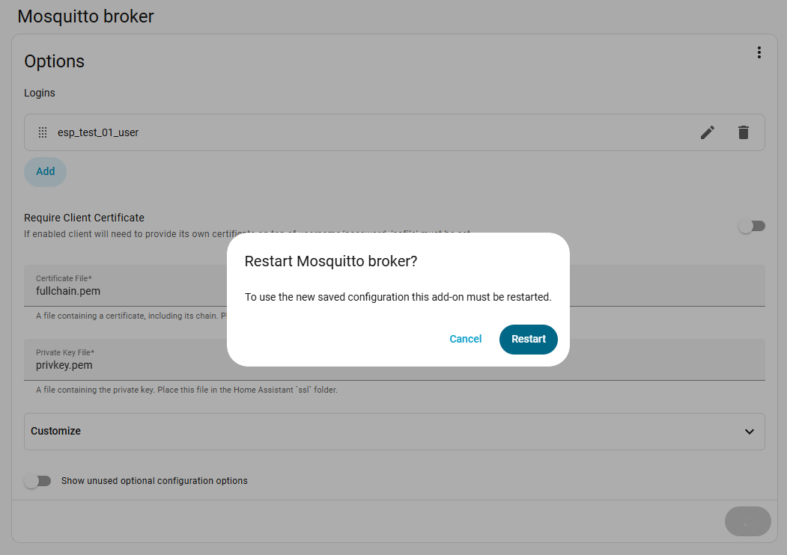

**4. Integration and Programming of the ESP32**

The goal is to use the "MQTT Auto-discovery" function for seamless
integration.

1.  **Board Programming:** Program your ESP32 with the Wi-Fi credentials
    and the MQTT authentication information created previously.

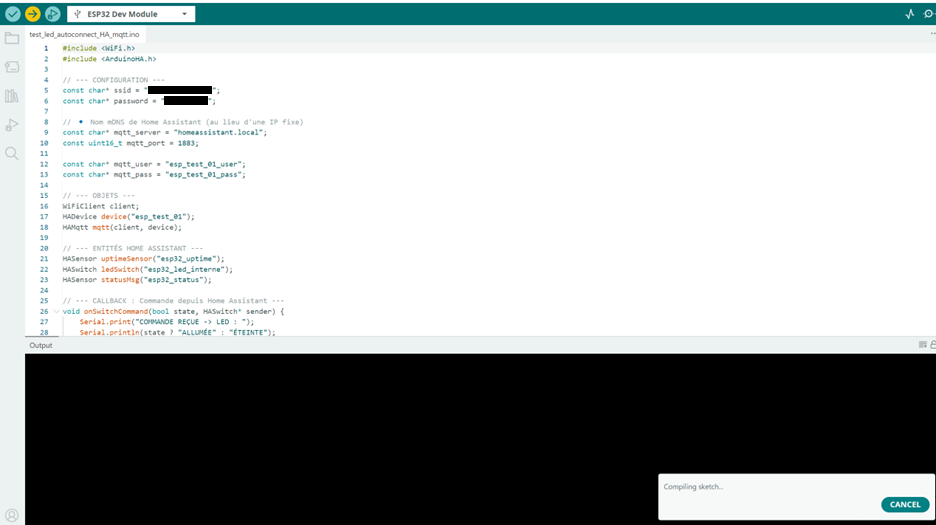

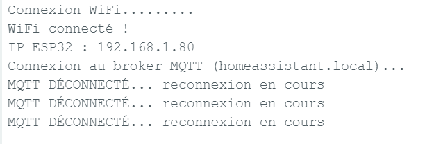

2.  **Activation of the integration :**

- In Home Assistant, go to **Settings \> Devices & Services**.

> 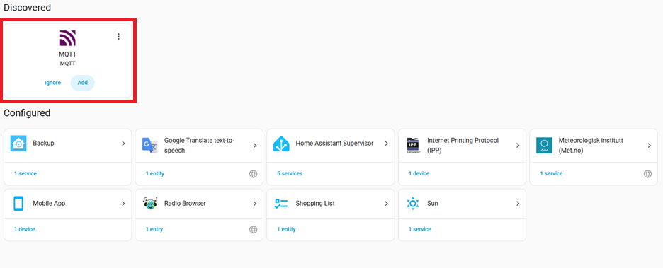 style="width:5.72823in;height:2.31944in" />

- Add the **MQTT integration**, validate the settings, and submit.

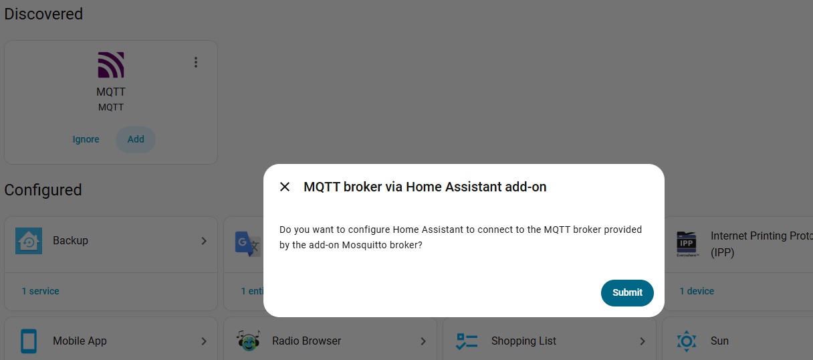

3.  **Verification:** Once connected to Wi-Fi, the ESP32 board will be
    automatically detected by Home Assistant.

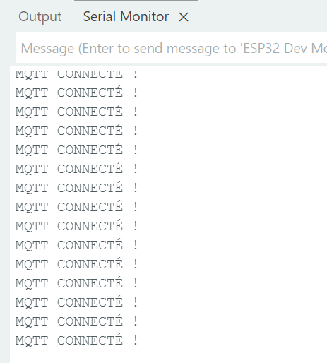

**5. Exploitation and Results**

- Control: You can now visualize the data from the ESP32 and control its
  peripherals (e.g., driving an LED) directly from the dashboard.

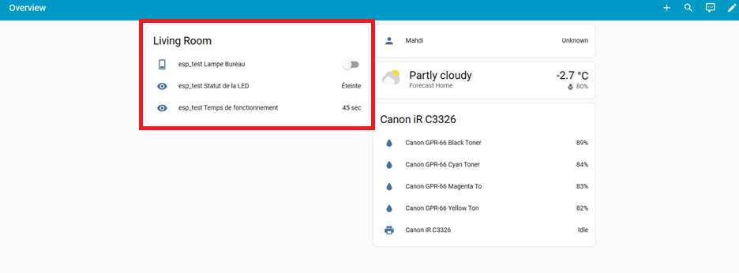

- **Serial Monitor:** Message reception can be confirmed via the board's
  serial port.

> 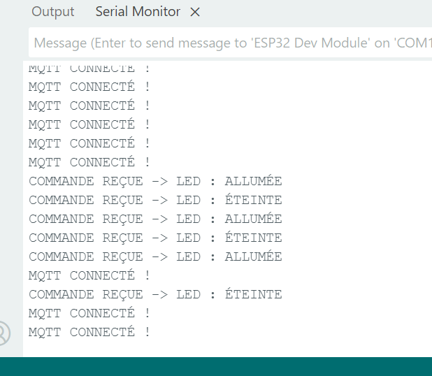 style="width:3.09889in;height:2.69774in" />

- **Scalability:** To add new devices, simply add the new MQTT
  credentials. They will be automatically added to your interface
  without any additional configuration.

> 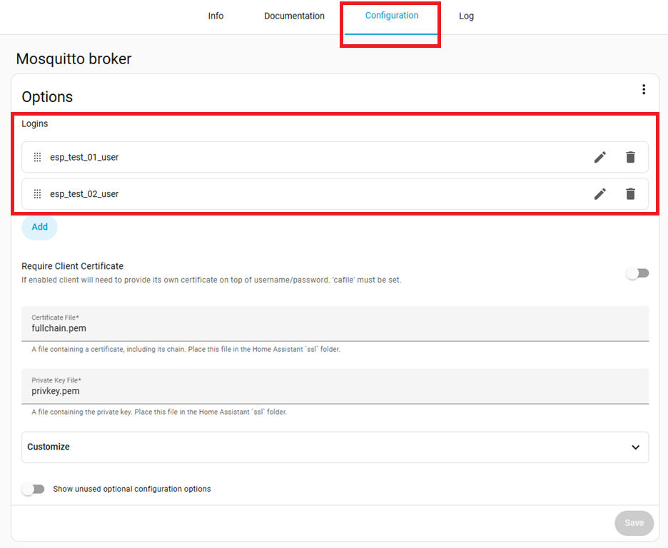
>
> Refresh Dashboard
>
> 
>
> 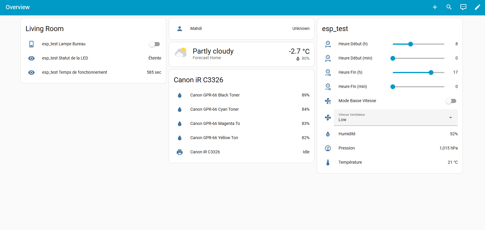
>
> Verify that all units are connected via MQTT.
>
> 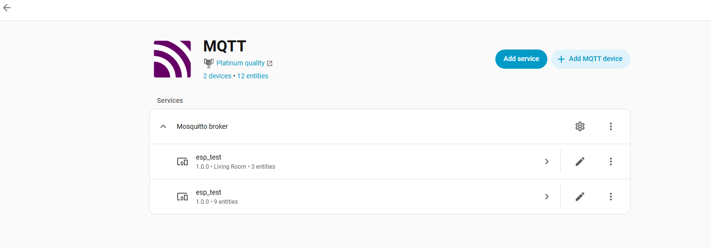
